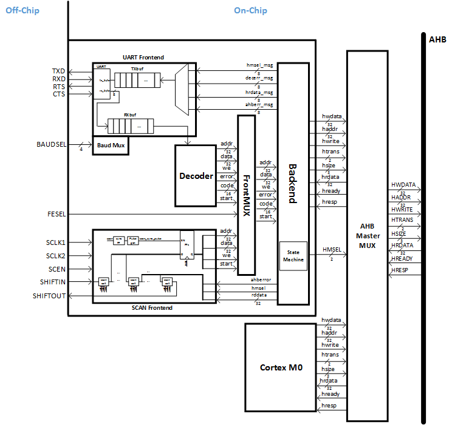
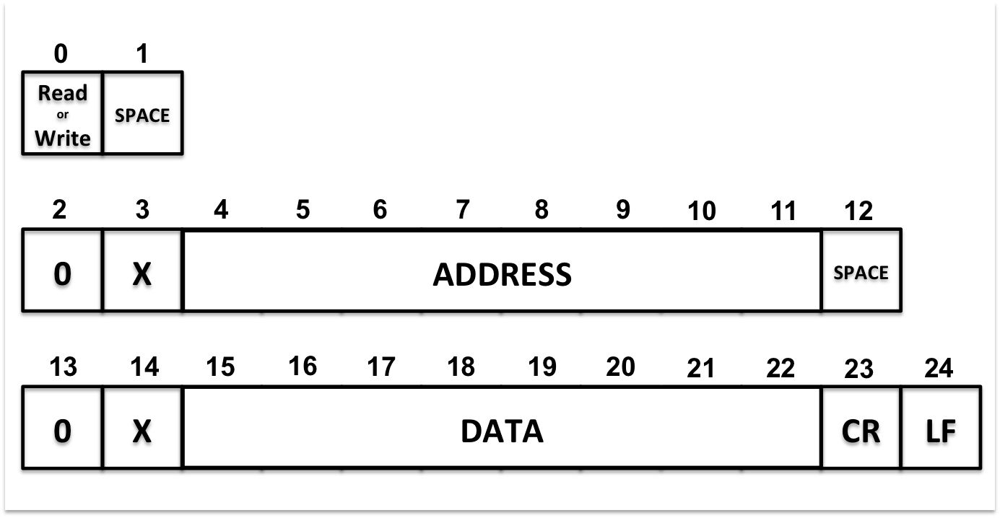

# UART AHB Master (COMMCTRL)

## Introduction

COMMCTRL is an AHB bus master that allows for straightforward off-chip hosting over a simple USB interface.  This makes test chip bring up and testing extremely quick and easy!

The off-chip hosting uses the standard UART protocol and therefore requires nothing more complicated than a simple terminal app for interactive tests.  For scripted tests, any UART library can be used, e.g. `pyserial` in a Python script.

#### TODO: Release Python testing CLI - Chip LOad Tool (CLOT)

## Description

Usage:
- Issues single bus transactions
    - Write a single 32b location
    - Read a single 32b location
- Use to:
    - read/write control and statue registers
    - Load SRAMs with binaries or data
    - Readback SRAMs containing data

### Block Diagram

### UART Protocol

- UART Configurations
    - Start bit : 1 bit
    - Data bit : 8 bits
    - Stop bit : 2 bits
    - Parity bit : None
    - Handshake : RTS/CTS hardware
- UART Speed Analysis  
    - 1 Byte needs 11 bits (1 start bit, 8 data bits, 2 stop bits)
    - 1 Instruction needs 25 Bytes (W 0x00000000 0x12341234 including CR+LF)
    - 1 Instruction can write 4 bytes
- Baud Rates

|Baud Sel|Baud Div|Baud Rates(bits/sec) for 50Mhz|Baud Rates(bits/sec) for 100Mhz|
|:---:|:---:|:---:|:---:|
|4'd0 |217|  **57,600**| **115,200**|
|4'd1 |108| **115,200**| **230,400**|
|4'd2 |54 | **230,400**| **460,800**|
|4'd3 |27 | **460,800**| **921,600**|
|4'd4 |25 |    NONE   |**1,000,000**|
|4'd5 |13 |1,000,000 |**2,000,000**|
|4'd6 |10 |1,250,000 |2,500,000|
|4'd7 |8  |1,500,000 |**3,000,000**|
|4'd8 |6  |2,000,000 ||
|4'd9 |5  |2,500,000 ||
|4'd10|4  |3,000,000 ||
|4'd11|TBD|||
|4'd12|TBD|||
|4'd13|TBD|||
|4'd14|TBD|||
|4'd15|TBD|||

- Loading Time

|Baud Rate (bits/sec)| 64KB  |  1MB   |
|:------------------:|:-----:|:------:|
|115,200             |39 sec |1040 sec|
|230,400             |20 sec |520 sec |
|460,800             |10 sec |260 sec |
|921,600             |4.9 sec|130 sec |
|1,000,000           |7.5 sec|120 sec |
|2,000,000           |3.7 sec|60 sec  |
|3,000,000           |1.9 sec|30 sec  |

### Supported Commands

||TYPE|SEPARATOR0|ADDRESS|SEPARATOR1|DATA|
|:---:|:---:|:---:|:---:|:---:|:---:|
|BYTE|0|1-3|4-11|12-14|15-22|
|WRITE|W / w|(space)0x|Address (32bit in hex)|(space)0x|Write Data (32bit in hex)|
|READ|R / r|(space)0x|Address (32bit in hex)|||
- All Instructions should be finished with line breaks in 2 bytes
    - |CR|LF|
    - |LF|
- DATA(bit 15-22) region will be ignored on READ.
- HMSEL[1:0]
    - Memory Region : 0x10000000
    - Possible Values
        - 2'b00 : commctrl (UART/Scan)
        - 2'b01 : CM0
        - 2'b10 : Not Used
        - 2'b11 : Not Used

<!---  --->

### ERROR Code
#### Decode Error
|PRIORITY|Error Code|Name|Resolution|
|:---:|:---:|:---:|:--- |
|0|10|Instruction Size|For Write, Instruction size should be 23 For Read, Instruction size should be between 12 and 23|
|1|11|Instruction Type|For Write, BYTE0 should be W or w For Read, BYTE0 should be R or r|
|2|20|Separator 0|BYTE1-3 should be (space)0x or (space)0X|
|3|21|Separator 1|BYTE12-14 should be (space)0x or (space)0X|
|4|22|Line Break |Line breaks should be CR+LF or LF|
|5|30|Address Byte 0 |Address Byte 0 should be a number in ASCII|
|6|31|Address Byte 1 |Address Byte 1 should be a number in ASCII|
|7|32|Address Byte 2 |Address Byte 2 should be a number in ASCII|
|8|33|Address Byte 3 |Address Byte 3 should be a number in ASCII|
|9|34|Address Byte 4 |Address Byte 4 should be a number in ASCII|
|10|35|Address Byte 5 |Address Byte 5 should be a number in ASCII|
|11|36|Address Byte 6 |Address Byte 6 should be a number in ASCII|
|12|37|Address Byte 7 |Address Byte 7 should be a number in ASCII|
|13|40|Write Data Byte 0 |Write Data Byte 0 should be a number in ASCII|
|14|41|Write Data Byte 1 |Write Data Byte 1 should be a number in ASCII|
|15|42|Write Data Byte 2 |Write Data Byte 2 should be a number in ASCII|
|16|43|Write Data Byte 3 |Write Data Byte 3 should be a number in ASCII|
|17|44|Write Data Byte 4 |Write Data Byte 4 should be a number in ASCII|
|18|45|Write Data Byte 5 |Write Data Byte 5 should be a number in ASCII|
|19|46|Write Data Byte 6 |Write Data Byte 6 should be a number in ASCII|
|20|47|Write Data Byte 7 |Write Data Byte 7 should be a number in ASCII|
- MESSAGE : **"DECODE_ERROR: errorcode"**
- if more than two errors occur at the same time, error code with lower priority is sent out through UART

#### AHB Error
- If unmapped memory region is accessed, the following error message will be sent out.
    - MESSAGE : **"AHB_ERROR: HADDR=address"**

#### Examples
- **Normal AHB Write/Read transactions**
    - Write 
      `W 0x00000000 0x12341234` 
      `W 0x00000004 0x43214321`
    - Read 
      `R 0x00000000` 
      HRDATA: 0x12341234 
      `R 0x00000004 2032` 
      HRDATA: 0x43214321
- **HMSEL Write/Read transaction**
    - Write 
      `W 0x10000000 0x00000001`
    - Read 
      `R 0x10000000` 
      HMSEL: 1

- **Decode Error**
    - **Instruction Size Error** 
      `W 0X00000004 0X2000456` 
      DECODE_ERROR: 10
    - **Separator Error** 
      `W 3X00000004 0X20000456` 
      DECODE_ERROR: 20
    - **Address Byte Error** 
      `W 0XP0000000 0X2000FC00` 
      DECODE_ERROR: 37
    - **Write Data Byte Error** 
      `W 0X00000000 0X2U00FC00` 
      DECODE_ERROR: 46
- **AHB Error** 
    - **Unmapped Region Access Error** 
      `W 0X70000010 0X00000000` 
      AHB_ERROR: HADDR=0X70000010 
      `R 0XFFFFFFFC` 
      AHB_ERROR: HADDR=0XFFFFFFFC 

### Scan Chain
- Scan Chain Front (scanfront.sv)
    - AHBERR : AHB Error
        - 1'b1 when ahb bus error occurs
    - HMSEL : HMSEL
        - read back the current HMSEL
    - RDDATA : read data
        - read back HRDATA
    - WRDATA : write data
        - Load data into HWDATA
    - ADDR : address
        - Write Address or Read Address
    - WE : write enable
        - 1'b1 = write, 1'b0 = read
    - AHBXFER : AHB transfer
        - 1'b1 = start state machine in backend
        - 1'b0 = Don't start state machine

|Signals|AHBERR|HMSEL|RDDATA|WRDATA|ADDR|WE|AHBXFER|
|:---:|:---:|:---:|:---:|:---:|:---:|:---:|:---:|
|Number of Bits|1|2|32|32|32|1|1|
|Location|[100]|[99:98]|[97:66]|[65:34]|[33:2]|[1]|[0]|

---
HKL 12 2015

