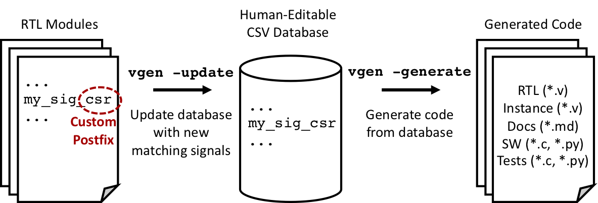

# Verilog GENerator (VGEN)

## Overview

In chip development, it is common to encounter repetitive coding tasks.
Typical examples include SoC memory-maps, control and status registers (CSRs), IO signals/pads, clocks and resets, and debug signals.
Implementing, maintaining and validating these kinds of things can be tedius and error-prone and often introduce significant risk into the tape-out project.

Sadly, SystemVerilog (SV) still has poor support for code generation; both the `generate` keyword and parameterization of modules in general is quite limited and hard to use efficiently.
The perennial preferred solution to this deficiency is to write * RTL generators* for these repetative coding tasks.
CHIPKIT includes `VGEN`, which is a simple Python framework for writing templated code generators.
In research projects, the design specification is often lacking in detail and may even be quite fluid during the implementation phase.
Therefore, it is essential to follow an agile process for developing and maintaining these repetative coding patterns.

`VGEN` is a lightweight Python module.
The database data structure is represented as a list of dictionaries.
The keys for the dictionaries are defined in the header line of the CSV file, so it is easy to add new attributes by simply editing the CSV file.
CHIPKIT currently includes example VGEN scripts for generating CSRs and IO pads, and is easily extensible to other common chip design tasks.
The figure below outlines the typical `VGEN` usage flow.

## CSR Example

As a prototypical example, consider the implementation of control and status registers (CSRs).
CSRs are memory mapped IO (MMIO) registers that hold programmable control parameters or allow for visibility into a design.
Whenever a new CSR is added during the design process, the following source files typically need to be updated: 1) SV RTL, 2) Markdown documentation, 3) C/Python software views, 4) C/Python tests.
Maintaining and validating all of this is extremely time consuming and error-prone.
`VGEN` automates the generation of all this code.

The figure above outlines the `VGEN` flow, which operates in two stages.
The first step is to update a CSR database with signals from the design, which can be done periodically as the RTL is developed.  
The VGEN tool automatically updates the database (`vgen -update`) by parsing RTL modules to find signal names with a matching prefix or postfix that indicates a CSR should be attached to the signal.
Any matching signals are then cross-referenced against the database to see if they already exist and if any extracted parameters, such as the bitwidth of the register have changed.
If it is a new addition or a modification, the change will be made in the database.
The database is stored in comma-separated value (CSV) format, which allows it to be easily viewed and edited in a spreadsheet program.
The CSV database can be version controlled alongside the RTL.

The second stage of operation is to proceed and generate templated output code with values from the database (`vgen -generate`).
For CSRs, an RTL module is generated with memory-mapped registers as described in the CSV database, along with code for a module instantiation template.
Documentation in Markdown format is also generated, along with C and Python software register definitions and tests to confirm correct operation of the automatically generated code.

## Pads Example

TODO
